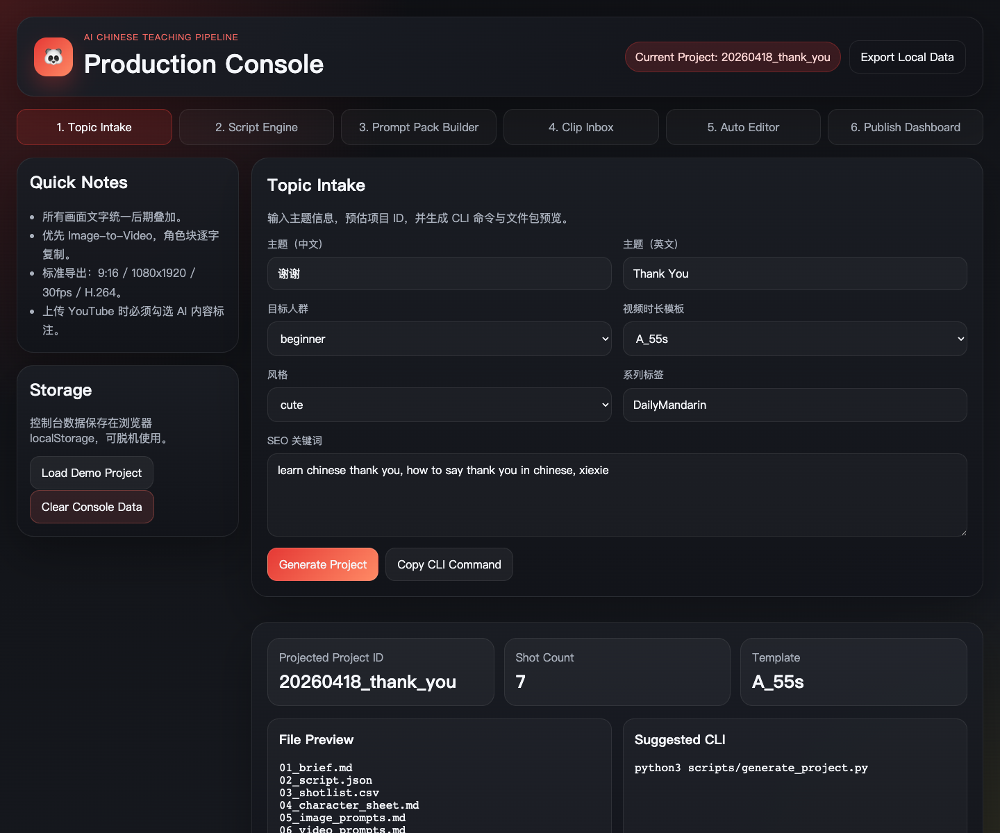
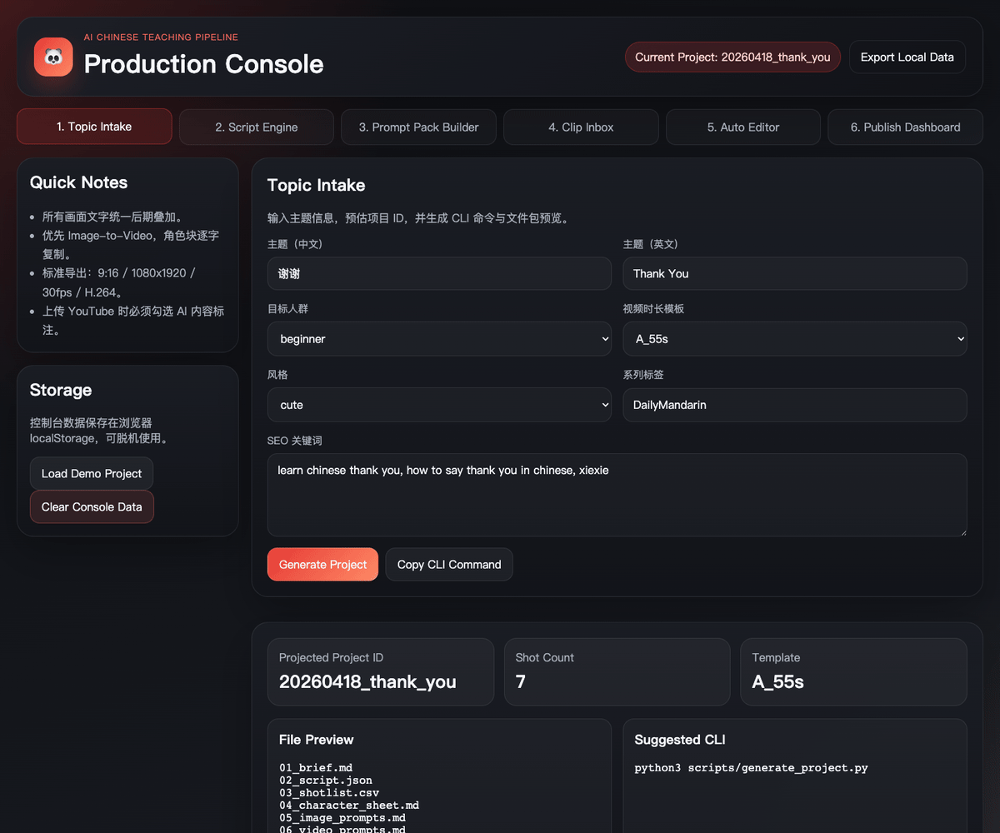

# Chinese Teaching Video System

[](./LICENSE)
[](#)
[](./README_CN.md)

[中文文档](./README_CN.md)

An open-source production system for AI-generated Chinese teaching animation shorts. It combines a browser-based control console, reusable production templates, and FFmpeg automation scripts so creators can turn one teaching topic into a repeatable short-form video workflow.

## Preview

### Web Console


### Demo GIF


## Why This Project Exists

Producing educational AI shorts consistently is hard because the workflow is fragmented:
- topic planning lives in notes
- shot breakdowns live in spreadsheets
- prompts get lost across tools
- asset tracking is manual
- post-production steps are repetitive

This repository turns that into a structured system with:
- character locking for a fixed panda teacher IP
- repeatable project scaffolding
- prompt generation support for LiblibAI, PixVerse V6, and Jimeng AI
- FFmpeg automation for assembly and finishing
- a browser console for planning, status tracking, and publishing prep

## Features

- Fixed character identity workflow through [config/character_sheet.md](./config/character_sheet.md)
- Standardized script, subtitle, SEO, and edit manifest templates in [templates](./templates)
- Per-video project generation via [scripts/generate_project.py](./scripts/generate_project.py)
- Automated editing pipeline with normalization, timeline assembly, subtitle burn-in, audio mixing, and intro/outro stitching in [scripts](./scripts)
- Pure frontend production console in [console](./console)
- Example project in [projects/_example_project](./projects/_example_project)
- Documentation covering workflow, platforms, FFmpeg, troubleshooting, and YouTube SEO in [docs](./docs)

## Core Workflow

1. Create a new project folder from a topic
2. Fill in the generated brief, script, prompts, subtitles, voiceover, SEO, and manifest
3. Generate keyframes in LiblibAI
4. Generate clips in PixVerse V6 and Jimeng AI
5. Place raw assets inside the project directory
6. Run the FFmpeg pipeline
7. Review output and publish with AI-content disclosure enabled

## Repository Structure

```text
chinese-teaching-video-system/
├── config/      # Character, brand, export, and platform configuration
├── templates/   # Script, prompt, subtitle, SEO, and edit manifest templates
├── scripts/     # Project generation and post-production automation
├── assets/      # Reusable assets and placeholder directories
├── projects/    # Per-video project folders and example project
├── console/     # Browser-based production console
└── docs/        # Workflow and reference documentation
```

## Quick Start

### 1. Enter the repository
```bash
cd /Users/adam/Desktop/chinese-teaching-video-system
```

### 2. Generate a new project
```bash
python3 scripts/generate_project.py
```

### 3. Open the web console
Open [console/index.html](./console/index.html) directly in your browser.

The console helps you:
- define a topic and project plan
- import and edit `02_script.json`
- build prompt packs for image and video generation
- track shot progress in a kanban workflow
- import `10_edit_manifest.json`
- prepare FFmpeg commands and publishing metadata

### 4. Run the full production pipeline
```bash
bash scripts/full_pipeline.sh <project_id>
```

### 5. Run quality checks
```bash
python3 scripts/quality_check.py <project_id>
```

## Web Console Modules

1. Topic Intake
2. Script Engine
3. Prompt Pack Builder
4. Clip Inbox & Asset Manager
5. Auto Editor
6. Publish Dashboard

## Production Rules

- Never let AI video platforms generate visible Chinese text, pinyin, or English subtitles inside the scene
- Prefer Image-to-Video workflows to stabilize character consistency
- Paste the character identity block verbatim into prompts
- Export in vertical `1080x1920`, `30fps`, `H.264 MP4`
- Always disclose altered or synthetic content when publishing to YouTube Studio

## Documentation

- [Project Spec](./PROJECT_SPEC.md)
- [Workflow Guide](./docs/workflow_guide.md)
- [Platform Guide](./docs/platform_guide.md)
- [FFmpeg Cheatsheet](./docs/ffmpeg_cheatsheet.md)
- [Troubleshooting](./docs/troubleshooting.md)
- [YouTube SEO Guide](./docs/youtube_seo_guide.md)

## Validation

The repository has already been validated with:
- JavaScript syntax checks for the web console
- Python compilation checks for the automation scripts
- Shell syntax checks for the pipeline scripts

## Roadmap

- Import/export sync between browser state and on-disk project files
- Visual timeline editing with persistent manifest updates
- Better reusable asset previews
- Optional automation hooks for n8n or publishing integrations
- Richer media capture and showcase automation

## Contributing

Contributions are welcome. Useful contribution areas include:
- new production templates
- more robust FFmpeg transitions and subtitle styling
- better project import/export flows
- improved prompt-builder logic
- docs and localization improvements

Please keep changes focused, document workflow impact clearly, and avoid committing generated media or private production assets unless they are intended as examples.

## License

This project is licensed under the [MIT License](./LICENSE).
